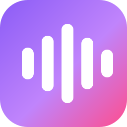

<div align="center">



# Syncwave

**A self-hosted Spotify Jam alternative — listen to music together, in perfect sync, with no accounts and no Premium.**

Start a room, share one link, and everyone hears the same second of the same
song. Shared queue, live chat, reactions, vote-to-skip and an optional AI DJ.
Runs on a computer you already own.


</div>

## Try it

Two ways, depending on what's already on the machine.

### Double-click it — nothing to install

1. **Code → Download ZIP**, and unzip it.
2. **Windows:** double-click `start.bat` · **macOS/Linux:** `./start.sh`

There is no step 3, and no step 0. If the machine has no Node 20+, the launcher
fetches an official copy, checks it against the published SHA-256 and keeps it
in a `.runtime` folder beside the app — nothing system-wide, and deleting that
folder undoes it. ffmpeg and a JS runtime come bundled, because YouTube refuses
downloads without one.

The first run builds (a few minutes); after that it starts in seconds, opens
your browser, and prints a **public HTTPS link** via a Cloudflare quick tunnel:

```
  On this computer   http://localhost:3000
  Share this link    https://reg-points-advised-course.trycloudflare.com
```

Send that to anyone, anywhere — no account, no port forwarding, no domain. Pass
`--local` to stay on your own network instead.

### Docker — for a box that stays on

```bash
git clone https://github.com/SAKMZ/syncwave.git && cd syncwave
cp .env.example .env
docker compose up -d --build
```

Then open **http://localhost:3000**. There's no tunnel in this mode — put it
behind your own domain or Tailscale, both in [DEPLOY.md](DEPLOY.md).

### Either way

Everything it stores lives in `./data` (rooms and settings) and `./cache`
(audio) — back those up or delete them, nothing else on the machine is touched.

On first run it sends you to **`/setup`** to set an admin password. Do that
straight away: until it's set, anyone who can reach the address can claim the
instance. Rooms themselves are unaffected — the password only guards
configuration.

<details>
<summary><b>Other ways to run it</b> — Linux one-liner, development, cloud host</summary>

<br />

**Dedicated Linux server:**

```bash
curl -fsSL https://raw.githubusercontent.com/SAKMZ/syncwave/main/scripts/install.sh | sudo bash
```

**Development:** `npm install && npm run dev`

**A cloud VPS needs one extra thing** — YouTube refuses most datacenter IPs, so
you need a proxy pool. One environment variable and playback works.

[](DEPLOY.md#option-d--railway)

</details>

**[DEPLOY.md](DEPLOY.md)** has all of it in full: every install path, a permanent
address via Tailscale or your own domain, the Railway walkthrough, keeping it
updated, the configuration reference, and what to do when a track won't play.

## See it running

<div align="center">


</div>

The room takes its colour from the album art, so it changes with the music. The
full recording — **[two minutes, unedited](docs/demo.mp4)** — has the rest: a
`/dj` line in chat becoming ten queued tracks and a spoken intro, a second
listener joining and talking, the queue, the activity feed, search and reactions.

Think group DJ session: a house party, a long-distance listening party, a study
room, a Discord community's permanent hangout. **If you've looked for a Spotify
Jam alternative**, or missed [JQBX](https://jqbx.fm), Vertigo, Turntable.fm or
plug.dj, this is that idea without the account requirement, the Premium
subscription, or somebody else's servers deciding when to shut it down.

## What you get

**In the room**

- 🎧 **Playback that stays locked together** — a server-authoritative clock on a
  monotonic timebase, so nobody drifts and a sleeping laptop can't drag the room
  backwards when it wakes.
- 🔗 **One-link rooms** — share a code or a URL. No accounts, for anyone.
- 📌 **Rooms that persist** — they survive restarts, so a link can live forever.
- 🗳️ **Vote-to-skip** — the room decides when to move on; the host can always drive.

**A queue people can actually run**

- ➕ **Anyone can add** — every track shows its art, artist, duration and who
  added it.
- ⬆️ **Upvotes move a track one place, per person** — ten people move it ten
  places; one enthusiast can't jump the room.
- ✋ **Drag to reorder**, server-confirmed, with keyboard parity on the grip.
- 🕘 **History and stats** — what played, who added it, what got skipped, who
  contributed most.

**A room that feels occupied**

- 🟢 **Live presence** — who's typing, queueing, voting, away or reconnecting. A
  phone locking mid-song holds its seat rather than announcing a departure.
- 💬 **Chat, and only chat** — joins, queues and skips go to a separate activity
  feed so conversation isn't buried under bookkeeping.
- 🎉 **Reactions** — six emoji, five animations, drawn from the event's own seed
  so every browser in the room renders the identical burst.
- 🌡️ **Room mood** — Party, Gaming, Late Night, Study and more, inferred from what
  the room has been doing. Click the badge and it explains itself.
- 🎨 **The interface takes its colour from the album art.**

**Finding something to play**

- 🔎 **Search songs, albums and artists**, with album drill-down and *Add all*.
- ✨ **Recommendations that name their own basis** rather than asking you to
  trust an unexplained list.
- 🤖 **An optional AI DJ** — six personas, takes requests as `/dj <what you want>`
  in chat, and introduces tracks in character. Runs on **Google Gemini** (free
  tier), OpenAI, Anthropic, or a local **Ollama** with no key at all. Off by
  default.

**The rest**

- 📱 **Built for a phone, not shrunk onto one** — swipeable panes, bottom sheets,
  and the controls you press often inside the thumb band.
- 📲 **Installable PWA** — install a room to the home screen and it reopens
  straight back into that room.
- ⌨️ **Keyboard shortcuts** throughout — press <kbd>?</kbd> in a room.
- ♿ **Accessible** — focus rings, live regions for the current track, keyboard
  parity for drag-reorder, `prefers-reduced-motion` and `prefers-contrast`
  honoured.
- 🔐 **No config files to edit** — a `/setup` wizard, then a password-protected
  `/admin` console.

## How it works

- A **Next.js** front end (App Router, React 19) is the room UI and the PWA.
- A custom **Socket.io** server is the single source of truth for the playback
  clock, queue, chat, presence and reactions. Clients render their `<audio>`
  position from the server's timestamps, so playback stays locked together.
- An audio resolver fetches each track with **yt-dlp**, caches it to disk, and
  serves it with HTTP range support. Search comes from `ytmusic-api`.
- State is durable in plain JSON files — no database. Cached audio evicts 72h
  after its last play, under a disk cap.

It all runs in **one process, one container**.

<details>
<summary><b>Keyboard shortcuts</b> — or press <kbd>?</kbd> in a room</summary>

<br />

| | |
| --- | --- |
| <kbd>Space</kbd> | Play / pause *(host)* |
| <kbd>J</kbd> / <kbd>L</kbd> | Back 10 seconds / next track *(host)* |
| <kbd>M</kbd> | Mute |
| <kbd>/</kbd> or <kbd>⌘K</kbd> | Search |
| <kbd>Q</kbd> · <kbd>C</kbd> · <kbd>H</kbd> | Queue · chat · history |
| <kbd>F</kbd> | Like the current track |
| <kbd>Esc</kbd> | Close whatever is open |

</details>

<details>
<summary><b>Questions people actually ask</b></summary>

<br />

**Does everyone need Spotify, or Spotify Premium?**
No. Nobody needs an account with anything. Audio is resolved server-side and
streamed from your instance, so listeners just open a link.

**Does it work on phones?**
Yes, and it's designed for them rather than reflowed onto them. Install a room
to the home screen and it reopens straight into that room.

**How many people can be in a room?**
There's no built-in cap. The practical limit is your upstream bandwidth: each
listener streams the track from your machine. A handful of friends on a home
connection is comfortable.

**Can I run it alongside Discord?**
That's the common setup — voice in Discord, music in a Syncwave room everyone
has open. Unlike a music bot, everyone hears it at full quality and can queue,
vote and see what's playing.

**Is it a Discord music bot / Watch2Gether / Teleparty for music?**
Same idea, different shape: a web room you host yourself, with a real queue and
a real player rather than a bot's text commands.

**Does the AI DJ have to be on?**
No. It's off by default and everything else works without it — Syncwave never
calls an LLM provider until you configure one yourself, and the key stays on
your instance.

**Do I have to pay for the AI DJ?**
No. Pick **Ollama** and it runs on your own machine with no key at all, or
**Google Gemini** and use a free key from
[aistudio.google.com/apikey](https://aistudio.google.com/apikey) — the DJ speaks
about once a track, so a room of friends is unlikely to leave the free tier.
OpenAI and Anthropic are there if you already pay for one.

**Where does the music come from?**
YouTube Music, fetched with yt-dlp and cached on your disk. See *Legal* below.

**Which browsers does the room need?**
Anything from 2023 onward — Chrome/Edge 111+, Safari 16.4+, Firefox 113+. The
interface leans on `color-mix()`, `oklab` and `dvh`, so an older browser will
render it, but with the wrong colours in places.

</details>

## Legal

Syncwave is a **self-host tool**. You run it and supply your own YouTube session;
you are responsible for how you use it in your jurisdiction. Streaming audio from
YouTube via unofficial tooling may violate YouTube's Terms of Service — do not
operate a public, for-profit service on top of it.

## Contributing

Issues and PRs are welcome. Good first areas: additional AI-DJ personas,
alternative audio sources, theming, and accessibility. If you deploy it somewhere
fun, open a discussion and say hi.

## License

[MIT](LICENSE) © 2026 Syncwave contributors
