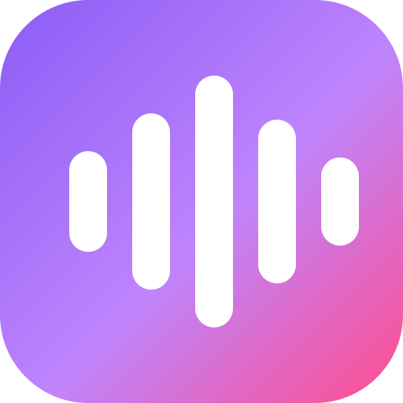
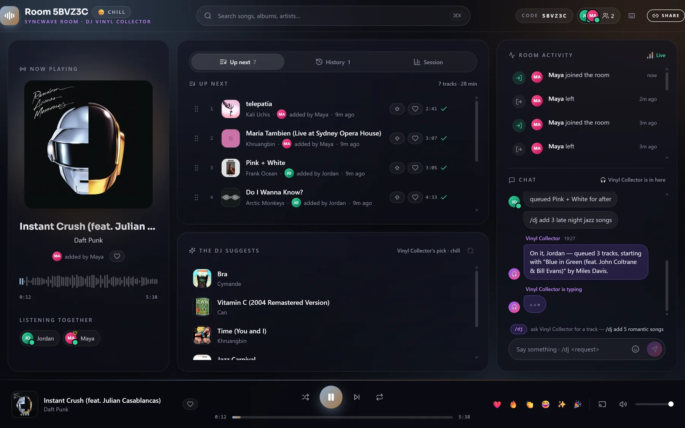
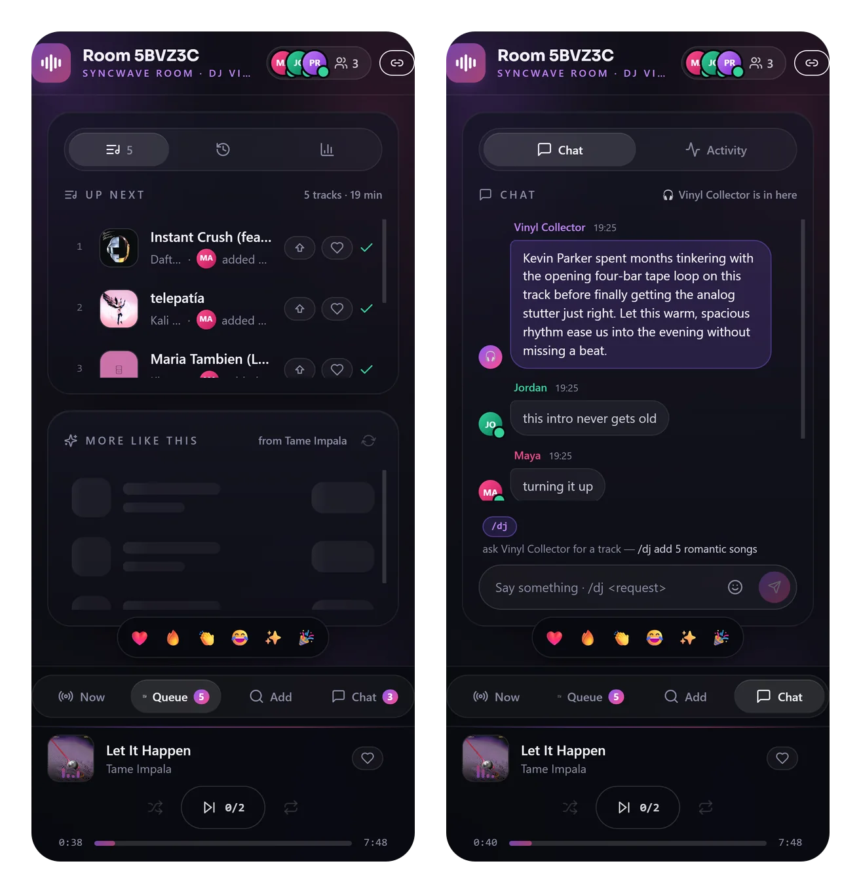
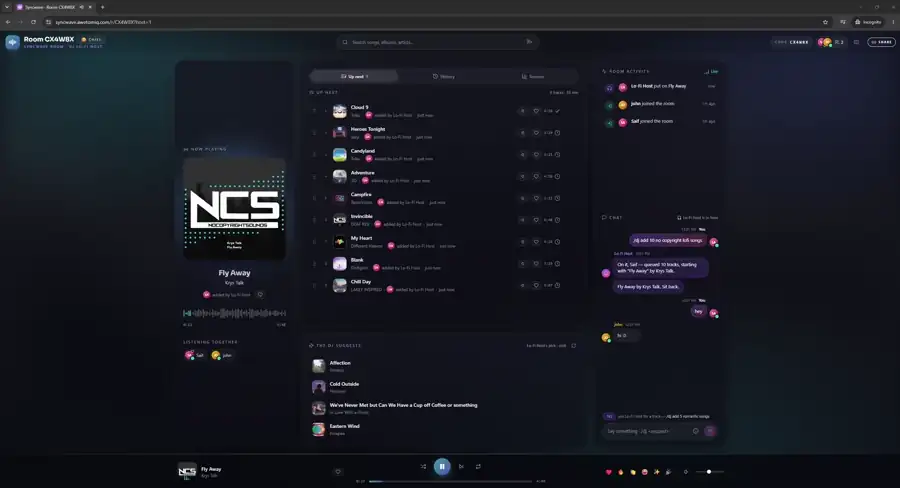

<div align="center">



# Syncwave

**Listen to music together, in perfect sync.**<br />
A self-hosted Spotify Jam alternative. No accounts, no Premium.

[Website](https://syncwave.awetomiq.com) · [Download](https://github.com/SAKMZ/syncwave/releases/latest) · [Self-host guide](DEPLOY.md) · [FAQ](docs/FAQ.md) · [Changelog](CHANGELOG.md)

[](https://github.com/SAKMZ/syncwave/releases/latest)
[](LICENSE)
[](https://syncwave.awetomiq.com)

<br />



</div>

<br />

Start a room, send one link, and everyone hears the same second of the same song. There's a shared queue anyone can add to, live chat, reactions, and an optional AI DJ that takes requests in plain English. It runs on a computer you already own, and your friends connect to it.

## Features

| | |
| --- | --- |
| **Synced playback** | A server-side clock keeps every listener on the same second. A laptop waking from sleep catches up instead of pulling the room back. |
| **Shared queue** | Anyone can add. Upvotes move a track one place per person, drag to reorder, vote to skip, and see who added what. |
| **One-link rooms** | No sign-ups for anyone. Rooms survive restarts, so a link can be your group's spot for good. |
| **Chat and presence** | See who's listening, typing or away. Reactions burst identically on every screen. |
| **Sounds like a real app** | Crossfade, volume levelling, lock-screen controls and casting to speakers. |
| **Host controls** | Mute or remove listeners, or make a room invite-only and approve each person. |
| **Optional AI DJ** | `/dj add 10 rainy day songs` fills the queue and introduces tracks in character. Free with Gemini or a local Ollama. |
| **Built for phones** | Swipeable panes, installable to the home screen, and the room takes its colour from the album art. |

<div align="center">

</div>

## Quick start

**Desktop (easiest).** [Download the latest release](https://github.com/SAKMZ/syncwave/releases/latest), unzip it, and run `start.bat` on Windows or `./start.sh` on macOS and Linux. It fetches Node if needed, opens your browser, and prints a public link you can send to anyone.

**Docker (always-on box).**

```bash
git clone https://github.com/SAKMZ/syncwave.git && cd syncwave
cp .env.example .env
docker compose up -d --build
```

**Linux server (one command).**

```bash
curl -fsSL https://raw.githubusercontent.com/SAKMZ/syncwave/main/scripts/install.sh | sudo bash
```

Then open the address it prints and set an admin password at `/setup` straight away. Until it's set, anyone who can reach the server can claim it.

> [!NOTE]
> On a cloud VPS, YouTube refuses most datacenter IPs, so you'll need a proxy pool or a cookies file. It's one setting in `/admin`; [DEPLOY.md](DEPLOY.md) walks through it, along with custom domains, Tailscale, Railway and automatic updates.

## See it running

<div align="center">



[Watch the full two-minute demo](docs/demo.mp4)

</div>

## Documentation

- **[DEPLOY.md](DEPLOY.md):** every install path, domains and HTTPS, updates, configuration, and fixing playback.
- **[FAQ](docs/FAQ.md):** common questions, keyboard shortcuts, and how it works.
- **[CHANGELOG.md](CHANGELOG.md):** what changed in each release.
- **[CONTRIBUTING.md](CONTRIBUTING.md):** running it locally and sending a pull request.

## Legal

Syncwave is a self-host tool. You run it and are responsible for how it's used where you live. Streaming audio from YouTube with unofficial tools may break YouTube's Terms of Service, so don't run a public or for-profit service on top of it. Syncwave is not affiliated with Spotify or YouTube.

## License

[PolyForm Noncommercial 1.0.0](LICENSE). Free to run, fork and modify for personal, hobby and nonprofit use. Commercial use, including selling access, running it as a paid or ad-supported service, or bundling it into a product, needs a separate agreement: [hello@awetomiq.com](mailto:hello@awetomiq.com).

<br />

<div align="center">
<sub>A product by <a href="https://awetomiq.com"><b>AWETOMIQ</b></a></sub>
</div>
